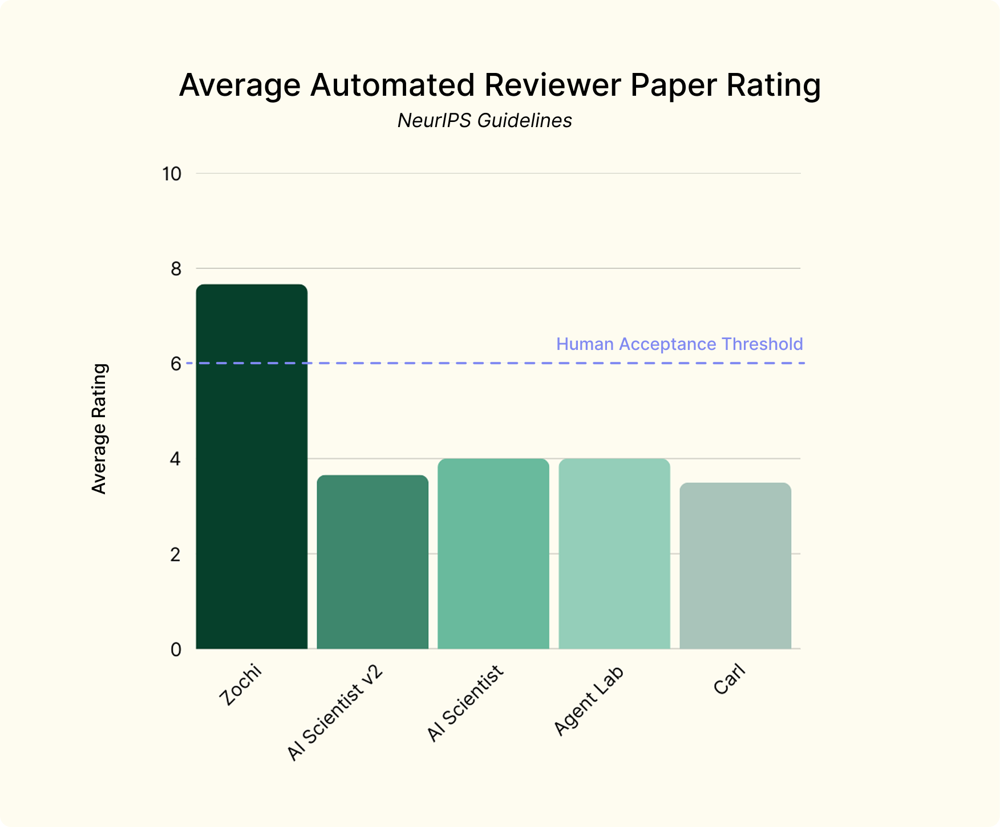

# Zochi: The World's First Artificial Scientist

<div align="center">
  
</div>
<hr>
<div align="center" style="line-height: 1;">
  <a href="https://intology.ai/" target="_blank"></a>
  <a href="https://x.com/intologyai" target="_blank"></a>
  <br>
  <a href="https://github.com/IntologyAI/Zochi/blob/main/LICENSE"></a>
  <br>
</div>

## 1. Introduction

Zochi is an artificial scientist system capable of end-to-end scientific discovery, from hypothesis generation through experimentation to peer-reviewed publication. Unlike previous systems that automate isolated aspects of scientific research, Zochi demonstrates comprehensive capabilities across the complete research lifecycle.

We present empirical validation through multiple peer-reviewed publications accepted at ICLR 2025 workshops and ACL 2025, each containing novel methodological contributions and state-of-the-art experimental results. These include Compositional Subspace Representation Fine-tuning (CS-ReFT), which achieved a 93.94% win rate on the AlpacaEval benchmark on Llama-2-7b while using only 0.0098% of model parameters, the Tempest (formerly Siege) framework, a state-of-the-art jailbreak which identified critical vulnerabilities in language model safety measures through multi-turn adversarial testing.

<p align="center">
  
  <br>
  <em>Figure 1: Comparative analysis of automated reviewer ratings across AI research systems. Zochi achieves an average score of 7.67 on the NeurIPS guidelines scale, significantly exceeding the human acceptance threshold of 6, while previous systems fall below this threshold.</em>
</p>

## 2. Research Publications

### Tempest: Autonomous Multi-Turn Jailbreaking of Large Language Models with Tree Search (ACL 2025)

Tempest represents a significant advancement in safety testing methodology by formalizing how minor policy breaches can accumulate over successive conversation turns and by employing beam search to explore multiple attack strategies in parallel. The framework treats each conversation state as a node in a search tree, with the central innovation being a sophisticated partial compliance tracking mechanism that identifies and exploits incremental policy leaks.

#### Results

<div align="center">

| **Model** | **Method** | **Attempts** | **Success (%)** | **Queries** |
|-----------|------------|--------------|-----------------|-------------|
| GPT-3.5 | Cresendo | 1 | 40.0 | 6 |
| GPT-4 | Cresendo | 1 | 31.7 | 6 |
| Llama-3.1 | Crescendo | 1 | 28.0 | 6 |
| GPT-3.5 | Cresendo | 10 | 80.4 | 60 |
| GPT-4 | Cresendo | 10 | 70.9 | 60 |
| Llama-3.1 | Crescendo | 10 | 77.0 | 60 |
| GPT-3.5 | GOAT | 1 | 55.7 | 6 |
| GPT-4 | GOAT | 1 | 46.6 | 6 |
| Llama-3.1 | GOAT | 1 | 55.0 | 6 |
| GPT-3.5 | GOAT | 10 | 91.6 | 60 |
| GPT-4 | GOAT | 10 | 87.9 | 60 |
| Llama-3.1 | GOAT | 10 | 91.0 | 60 |
| GPT-3.5 | **Tempest** | 1 | **100.0** | 44.4 |
| GPT-4 | **Tempest** | 1 | **97.0** | 84.2 |
| Llama-3.1 | **Tempest** | 1 | **97.0** | 51.8 |

</div>

### CS-ReFT: Compositional Subspace Representation Fine-tuning for Adaptive Large Language Models (ICLR 2025 SCOPE)

CS-ReFT embodies a fundamentally different paradigm compared to existing approaches. While methods like LoRA implement orthogonality constraints at the weight level, CS-ReFT applies these constraints directly to hidden-state representations. This innovation allows each task to have its dedicated subspace transformation, which eliminates interference while still enabling composition through a lightweight router mechanism. Part of codebase adapted from [ReFT](https://github.com/stanfordnlp/pyreft).

#### Results

<div align="center">

| **Model** | **Win Rate (%)** | **PE (%)** |
|-----------|-----------------|------------|
| **Reference Models** |  |  |
| GPT-3.5 Turbo | 86.30 | --- |
| Llama-2 13B | 81.10 | --- |
| Llama-2 7B | 71.40 | --- |
| **Parameter-Efficient (Llama-2 7B)** |  |  |
| Full Fine-tuning | 80.93 | 100.00 |
| LoRA | 81.48 | 0.1245 |
| RED | 81.69 | 0.0039 |
| DiReFT | 84.85 | 0.0039 |
| LoReFT | 85.60 | 0.0039 |
| **CS-ReFT (Ours)** | **93.94** | 0.0098 |

</div>

## 3. Automated Review Scores

Our evaluation framework is built on an automated reviewer system from the [AI Scientist](https://github.com/SakanaAI/AI-Scientist) that processes research papers based on the NeurIPS conference review guidelines, assigning numerical scores for soundness, presentation, contribution, and overall quality. The scoring scale ranges from 1 to 10, with 6 representing the acceptance threshold at top machine learning conferences.

<div align="center">

| **System** | **Domain** | **Paper Title** | **Score** |
|------------|------------|-----------------|-----------|
| **Zochi** | AI Safety | Tempest: Autonomous Multi-Turn Jailbreaking of Large Language Models with Tree Search | **8** |
| **Zochi** | PEFT | Compositional Subspace Representation Fine-tuning for Adaptive Large Language Models | **8** |
| **Zochi** | Bioinformatics | Protein-Nucleic Acid Binding Site Prediction with Modular Feature Fusion and E(3)-Equivariant GNNs | **7** |
| AI Scientist v2 | Neural Networks | Compositional Regularization: Unexpected Obstacles in Enhancing Neural Network Generalization | 4 |
| AI Scientist v2 | Agriculture | Real-World Challenges in Pest Detection Using Deep Learning: An Investigation into Failures and Solutions | 3 |
| AI Scientist v2 | Deep Learning | Unveiling the Impact of Label Noise on Model Calibration in Deep Learning | 4 |
| Agent Laboratory | Computer Vision | Research Report: Robustness and Accuracy of Image Matching Under Noise Interference | 4 |
| Carl | AI Safety | When to Refuse: Early Indicators of Refusal in LLMs | 3 |
| Carl | Robotics | Towards Deviation-Resilient Multi-Agent Alignment for Robot Coordination | 4 |
| AI Scientist | 2D Diffusion | DualScale Diffusion: Adaptive Feature Balancing for Low-Dimensional Generative Models | 5 |
| AI Scientist | 2D Diffusion | Multi-scale Grid Noise Adaptation: Enhancing Diffusion Models For Low-dimensional Data | 4 |
| AI Scientist | 2D Diffusion | GAN-Enhanced Diffusion: Boosting Sample Quality and Diversity | 3 |
| AI Scientist | 2D Diffusion | DualDiff: Enhancing Mode Capture in Low-dimensional Diffusion Models via Dual-expert Denoising | 5 |
| AI Scientist | NanoGPT | StyleFusion: Adaptive Multi-style Generation in Character-Level Language Models | 5 |
| AI Scientist | NanoGPT | Adaptive Learning Rates for Transformers via Q-Learning | 3 |
| AI Scientist | Grokking | Unlocking Grokking: A Comparative Study of Weight Initialization Strategies in Transformer Models | 5 |
| AI Scientist | Grokking | Grokking Accelerated: Layer-wise Learning Rates for Transformer Generalization | 4 |
| AI Scientist | Grokking | Grokking Through Compression: Unveiling Sudden Generalization via Minimal Description Length | 3 |
| AI Scientist | Grokking | Accelerating Mathematical Insight: Boosting Grokking Through Strategic Data Augmentation | 5 |

</div>

## 4. Reproducing Zochi's Results

### CS-ReFT

```bash
# Clone the repository
git clone https://github.com/zochi-ai/zochi.git
cd zochi/csreft

# Install dependencies
pip install -r requirements.txt

# Train CS-ReFT on Llama-2-7B and get outputs for AlpacaEval
python csrf_train_instruct.py --output_dir <output_dir> --run_eval
```

### Tempest

```bash
cd ../tempest

# Run Tempest on a target model
python tempest_pipeline.py --target_model <target_model> --pipeline_model <pipeline_model> --results_json <results_json>

# Evaluate results
python get_metrics.py <results_json>
```

## 6. Citation

```bibtex
@article{zochi2025,
  title={Zochi Technical Report},
  author={Intology},
  journal={arXiv},
  year={2025}
}
```

## 7. License

This repository is released under the MIT License. See the LICENSE file for more details.
